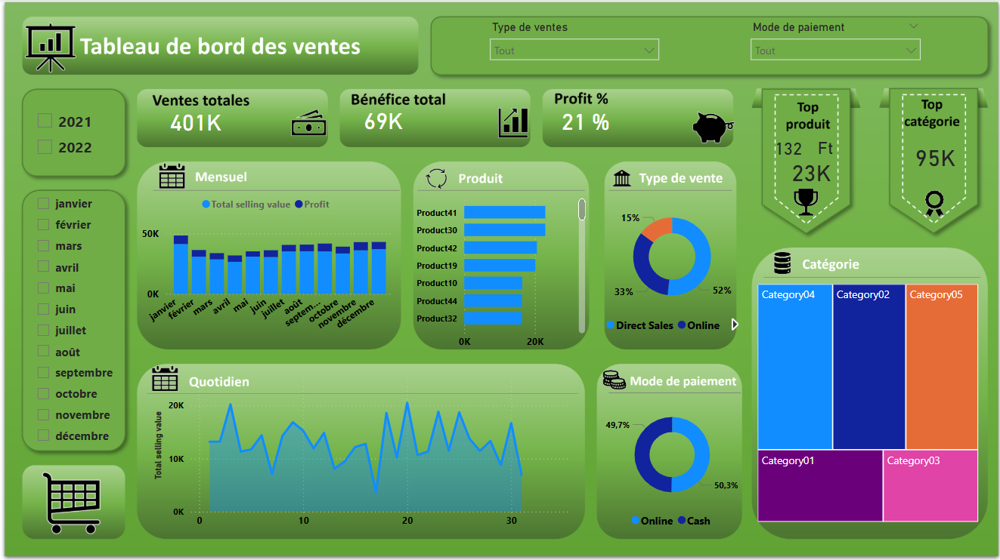

# 📊 Dashboard des Ventes

  

---

## 🎯 Contexte
En tant que **data analyste**, j’ai conçu un **dashboard interactif de ventes** à partir d’un fichier Excel structuré en deux tables :  

- **Master Data** : transactions détaillées (dates, montants, bénéfices, canaux).  
- **Input Data** : informations de référence (produits, catégories, modes de paiement, canaux).  

L’objectif : fournir un outil clair et dynamique pour aider le management à suivre la performance commerciale et identifier des leviers de croissance.

---

## ❓ Objectifs
- Suivre les **indicateurs financiers clés** : ventes, bénéfices, profitabilité.  
- Identifier les **catégories et produits les plus performants**.  
- Analyser l’**évolution mensuelle des ventes et bénéfices**.  
- Comprendre la répartition par **canaux de vente et modes de paiement**.

---

## 🔍 Approche
1. **Préparation des données** : nettoyage, gestion des doublons, normalisation et mise en relation des tables.  
2. **Création des KPI** : ventes totales, bénéfices, taux de profit, top catégorie, top produit.  
3. **Conception du dashboard Power BI** :  
   - Cartes pour les KPI principaux  
   - Graphiques pour l’évolution mensuelle  
   - Visualisations pour la répartition par catégories, produits, canaux et paiements

---

## 📊 Résultats
| Indicateur | Valeur |
|------------|-------|
| **Ventes totales** | 401K |
| **Bénéfice total** | 69K |
| **Taux de profit** | 21% |
| **Top catégorie** | Catégorie 4 (95K) |
| **Top produit** | Product 41 (23K) |
| **Répartition par canaux** | Direct 52%, Online 33% |
| **Modes de paiement** | Online 50.3%, Cash 49.7% |

---

## ✅ Insights & Recommandations
- Les performances sont concentrées sur une catégorie et un produit → **renforcer ces segments**.  
- Les ventes présentent une **saisonnalité** → ajuster la logistique et le marketing selon les périodes.  
- Le canal online progresse mais reste derrière le direct → **fort potentiel de croissance**.  
- Répartition équilibrée cash/digital → **transition vers le numérique**.

---

## 🛠 Compétences mobilisées
- Nettoyage et transformation des données (**Excel, Power Query**)  
- Modélisation et relations de tables (**Power BI**)  
- Création d’un **dashboard interactif**  
- **Analyse business** et recommandations stratégiques

---

## 📁 Contenu du repository
- `dataset.xlsx` : fichier de données source  
- `Dashboard_Ventes.pbix` : fichier Power BI  
- `screenshot_dashboard.png` : capture d’écran du dashboard
